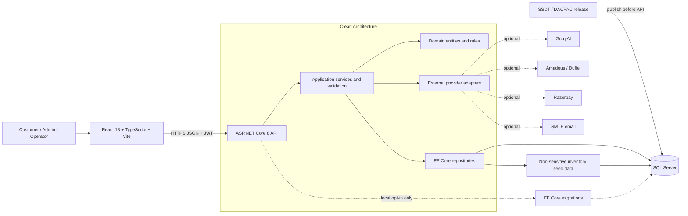

# TravelPort

TravelPort is a Goibibo-inspired travel booking platform for flights, hotels, buses, trains, and cabs. It includes customer booking flows, payments and wallets, role-based operator portals, administration, PDF invoices, notifications, and optional AI-assisted travel planning.

> This repository is maintained by Prakash Infotech. It contains no production credentials or default user passwords.

## Application flow and architecture



Typical request flow:

1. The browser searches or submits a booking through the React application.
2. The API authenticates the request, validates input, and calls application services.
3. EF Core repositories read or update SQL Server inside the persistence layer.
4. Optional integrations are used only when their credentials and `Enabled` flags are configured.
5. Responses return through the API; invoice endpoints generate PDFs server-side.

## Features

- Flight and hotel search, booking, cancellation, coupons, and invoice download
- Deterministic bus, train, and cab search and booking flows
- JWT access tokens, refresh tokens, password reset, and role-based authorization
- Wallet top-up, wallet payments, refunds, and saved payment-card metadata
- Hotel manager, flight operator, bus operator, cab operator, and admin portals
- Optional Razorpay payments and SMTP notifications
- Optional Groq chatbot, natural-language search, recommendations, trip planner, and price insights
- SQL Server persistence with an SSDT/DACPAC deployment project, stored procedures, views, functions, and non-sensitive inventory seed data
- Swagger/OpenAPI documentation, rate limiting, CORS, validation, and structured logging

## Technology stack

| Layer | Technology |
|---|---|
| Frontend | React 18, TypeScript, Vite 6, Redux Toolkit, React Router, Tailwind CSS |
| Backend | .NET 8, ASP.NET Core Web API, FluentValidation, Serilog |
| Database | SQL Server 2019+, Microsoft.Build.Sql SSDT/DACPAC, EF Core 8 |
| Authentication | JWT bearer tokens and BCrypt password hashing |
| Documents | PDFsharp 6 |
| Testing | xUnit and Vitest |
| Local containers | Docker Compose, SQL Server, ASP.NET Core, Nginx |

## Prerequisites

Choose either Docker or local development.

- Git
- Docker Desktop with Compose (recommended), or:
  - .NET 8 SDK
  - Node.js 20+ and npm
  - SQL Server Express or another SQL Server instance
- Optional provider accounts only when testing Groq, Amadeus, Duffel, Razorpay, or SMTP

## Clone and configure

```bash
git clone https://github.com/prakashinfotech/travel-port.git
cd travel-port
```

Never place real credentials in committed files. Create local files from the supplied templates:

```powershell
Copy-Item .env.example .env
Copy-Item backend/src/API/appsettings.Development.json.example backend/src/API/appsettings.Development.json
Copy-Item frontend/.env.example frontend/.env
```

Set at minimum:

- Docker: `DB_SA_PASSWORD` and a random `JWT_SECRET` of at least 32 characters in `.env`.
- Local backend: `ConnectionStrings:DefaultConnection` and `JwtSettings:Secret` in the ignored development settings file or [.NET User Secrets](https://learn.microsoft.com/aspnet/core/security/app-secrets).

All optional integrations are disabled or have empty credentials by default. See [Security Guide](docs/SECURITY_GUIDE.md) for the configuration map.

## Run with Docker

Docker Compose builds both application images locally; no personal container registry is required.

```bash
docker compose up --build
```

- Web application: `http://localhost`
- Swagger: `http://localhost/api/swagger`
- SQL Server is internal to the Compose network

For local Docker only, the API opts into EF migration startup so a fresh container can initialize automatically. Company environments publish the DACPAC before deploying the API. Both paths insert only non-sensitive flight, hotel, room, and coupon data; no users, passwords, wallets, or sample bookings are created.

Stop the environment with:

```bash
docker compose down
```

Use `docker compose down -v` only when you intentionally want to delete the local database volume.

## Run locally

### Backend

```bash
cd backend
dotnet restore TravelPort.sln
dotnet build src/Database/TravelPort.Database.sqlproj --configuration Release
sqlpackage /Action:Publish /SourceFile:src/Database/bin/Release/TravelPort.Database.dacpac /TargetConnectionString:"<local-connection-string>" /p:BlockOnPossibleDataLoss=True
dotnet run --project src/API --launch-profile http
```

The API and Swagger run at `http://localhost:5000` and `http://localhost:5000/swagger`.

### Frontend

In a separate terminal:

```bash
cd frontend
npm ci
npm run dev
```

The frontend runs at `http://localhost:5173` and proxies `/api` requests to the local API.

Register a new user through the application or `POST /api/v1/auth/register`. No public default accounts are provided.

## Database deployment and schema changes

The SSDT project at `backend/src/Database/TravelPort.Database.sqlproj` is the deployment authority. It builds a versionable DACPAC containing the complete table schema, stored procedures, functions, views, and idempotent non-sensitive post-deployment data. Publish it before the API in shared environments.

```bash
# Build the DACPAC
dotnet build backend/src/Database/TravelPort.Database.sqlproj --configuration Release

# Preview a deployment script
sqlpackage /Action:Script \
  /SourceFile:backend/src/Database/bin/Release/TravelPort.Database.dacpac \
  /TargetConnectionString:"<target-connection-string>" \
  /OutputPath:TravelPort.deploy.sql \
  /p:BlockOnPossibleDataLoss=True
```

The retained EF Core migration chain mirrors the application model and provides an explicitly enabled local-development fallback. `Database:ApplyEfMigrations` is `false` by default and must remain disabled in deployed API configuration. Every schema change must update and review both representations, with the DACPAC used for deployment. See [Database Scripts](database/README.md) and [Database Design](docs/DATABASE_DESIGN.md).

## Tests and verification

Run the shared test gate from the repository root:

```powershell
.\scripts\test-all.ps1
```

Or run each part:

```bash
dotnet test backend/TravelPort.sln --configuration Release
dotnet build backend/src/Database/TravelPort.Database.sqlproj --configuration Release
npm run lint --prefix frontend
npm run test --prefix frontend -- --run
npm run build --prefix frontend
```

Dependency checks:

```bash
dotnet list backend/TravelPort.sln package --vulnerable --include-transitive
npm audit --prefix frontend --audit-level=low
```

CI builds and uploads the DACPAC, restores and tests the API, lints/tests/builds the frontend, audits dependencies, and validates Docker Compose on pushes and pull requests to `master`. The manual database workflow publishes the DACPAC first and exposes an API deployment gate; company application-hosting details must be configured before that final deployment step is automated.

## Project structure

```text
travel-port/
├── backend/
│   ├── src/API/              # Controllers, middleware, startup, configuration templates
│   ├── src/Application/      # Use cases, DTOs, validators, interfaces
│   ├── src/Domain/           # Entities and enums
│   ├── src/Infrastructure/   # Auth, providers, email, payments, PDF documents
│   ├── src/Persistence/      # DbContext, repositories, migrations, safe seed data
│   └── tests/                # xUnit tests
├── frontend/                 # React and TypeScript SPA
├── database/                 # Generated idempotent migration script
├── docs/                     # Architecture, API, database, security, testing
├── scripts/                  # Cross-platform verification commands
├── docker-compose.yml
└── README.md
```

## Documentation

| Document | Purpose |
|---|---|
| [Architecture](docs/ARCHITECTURE.md) | Components, data flow, authentication, and design decisions |
| [API Documentation](docs/API_DOCUMENTATION.md) | REST endpoint reference |
| [Database Design](docs/DATABASE_DESIGN.md) | Tables, relationships, migrations, and seed policy |
| [Security Guide](docs/SECURITY_GUIDE.md) | Secrets, authentication, CORS, data protection, and limitations |
| [Testing Guide](docs/TESTING_GUIDE.md) | Local and CI test commands |
| [Software Requirements](docs/SRS.md) | Public-release functional and quality requirements |
| [Technical Design](docs/TECHNICAL_DESIGN.md) | Components, security, database delivery, and release flow |
| [Generated PDFs](docs/pdfs/) | Current API, deployment, SRS, and technical-design documents |
| [Contributing](CONTRIBUTING.md) | Branch, commit, review, and verification workflow |
| [AI Usage Report](docs/AI_USAGE_REPORT.md) | Historical AI-assisted development disclosure and current provider note |

## Security

- Do not commit `.env`, `appsettings.Development.json`, API keys, passwords, tokens, certificates, or connection strings.
- Rotate any credential accidentally exposed in Git history; deleting it from the latest revision is insufficient.
- Store production values in the company-approved secret manager or CI environment.
- Report security concerns privately to the repository maintainers rather than opening a public issue.

## License

TravelPort is available under the [MIT License](LICENSE).

Copyright (c) 2026 Prakash Infotech.
