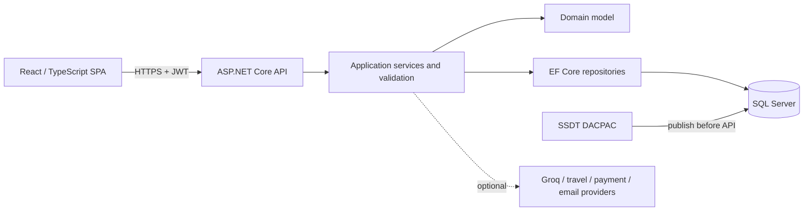

# TravelPort Technical Design

## Architecture

The backend follows Clean Architecture: Domain has no infrastructure dependencies; Application owns use cases and interfaces; Persistence and Infrastructure implement data and provider concerns; API composes middleware, dependency injection, authentication, and HTTP endpoints.

## Database design and delivery

`backend/src/Database/TravelPort.Database.sqlproj` contains the complete deployable schema: 22 tables, indexes, foreign keys, 6 stored procedures, 4 functions, 3 views, and an idempotent catalogue-only post-deployment seed. Microsoft.Build.Sql produces a SQL Server 2019-compatible DACPAC. The manual deployment workflow publishes this artifact before the API gate with possible data loss blocked.

The EF Core DbContext maps the same schema. Its migration chain is retained for model history and the local Docker fallback; `Database:ApplyEfMigrations` is disabled by default for deployed APIs.

## Security design

- JWT bearer authentication and BCrypt password hashing
- Role and ownership authorization at service/controller boundaries
- Refresh-token persistence and cleanup
- FluentValidation request validation and centralized exception handling
- CORS allow-list, rate limiting, structured logging, and soft deletion
- Empty committed secret fields; optional integrations disabled when credentials are absent
- Payment-card metadata limited to non-sensitive display fields

## Runtime and deployment flow

1. CI restores dependencies, builds/tests .NET, builds the DACPAC, audits NuGet, lints/tests/builds the SPA, audits npm, and validates Compose.
2. A protected manual deployment builds and publishes the DACPAC to the selected environment.
3. Only after database success does the workflow expose the API deployment gate.
4. The API starts with EF auto-migration disabled, connects to the published schema, and applies non-sensitive idempotent catalogue seeding.
5. Nginx serves the SPA and proxies `/api` to the API container or service.

## Failure behavior

Optional external providers use configuration flags and safe fallbacks. Database changes are reviewed through target-specific SqlPackage scripts, backups precede shared publication, and application rollback uses the previously approved immutable build. Database rollback relies on a verified backup or separately reviewed rollback script.

## Verification

The release gate requires 562 backend tests, four frontend unit tests, frontend lint/build, zero known npm and NuGet advisories, successful DACPAC publish to a disposable database, valid Docker Compose configuration, and secret scanning of source, PDFs, and clean Git history.

Copyright © Prakash Infotech. All rights reserved.
